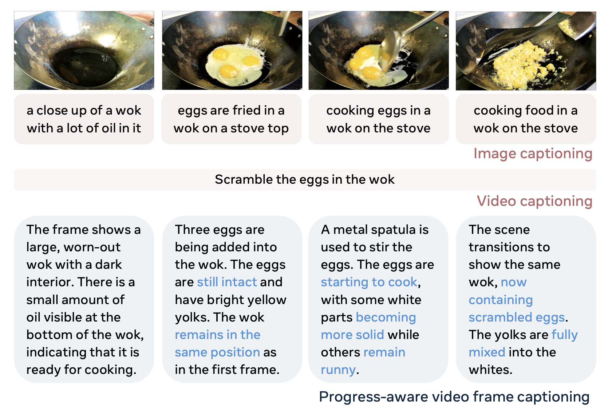
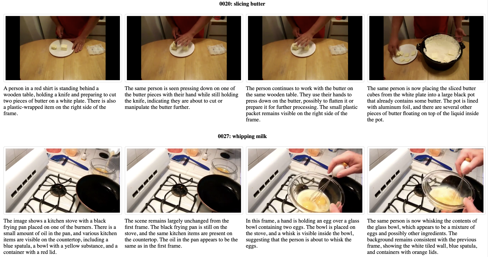
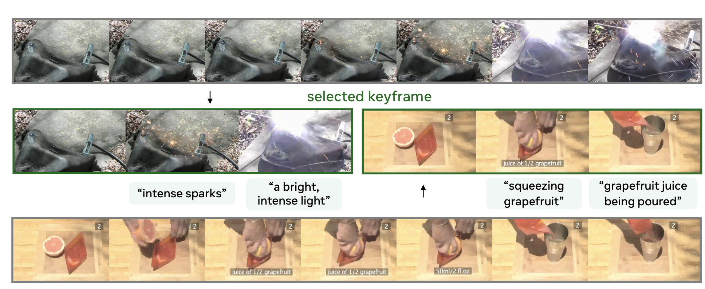

# Progress-Aware Video Frame Captioning
[**Progress-Aware Video Frame Captioning**](https://arxiv.org/abs/2412.02071)   
Zihui Xue, Joungbin An, Xitong Yang, Kristen Grauman  
CVPR, 2025   
[project page](https://vision.cs.utexas.edu/projects/ProgressCaptioner/) | [arxiv](https://arxiv.org/abs/2412.02071) | [bibtex](#citation)

This codebase builds upon the excellent [LLaVA-NeXT](https://github.com/LLaVA-VL/LLaVA-NeXT) repository. We deeply appreciate their efforts in open-sourcing!

## Overview 
We propose progress-aware video frame captioning (bottom), which aims to generate a sequence of captions that capture the temporal dynamics within a video.
<p align="left">
  
</p>

## Getting Started

### Environment Setup
```bash
conda create -n progcap python=3.10 -y
conda activate progcap
cd LLaVA-NeXT
pip install -e ".[train]"
pip install flash-attn==2.6.3
```

### Data and Model Checkpoint
1. We provide pre-processed frame sequences for the benchmarks used in our paper:
  * HowToChange: `data/data_files/input/htc_valhs_seq.json`
  * COIN: `data/data_files/input/coin_valhs_seq.json`
  * These frames are extracted at 1fps, filtered, and manually verified for assessing fine-grained action progress. Download the frames [here](https://drive.google.com/drive/folders/1qQy74ppmVg-YEYjdptoZIngJ1h7u3pQv?usp=sharing), and place them under the `data/` folder. Ensure the paths match those expected by the JSON files or update the JSONs accordingly.

2. To run inference on your own video data:
  * Run `python prepare_data.py --video_file VIDEO_FILE` (adjust arguments as needed) to extract frames from video and create a JSON file like `data/data_files/input/one_example.json`. 


3. ProgressCaptioner model checkpoint is available [here](https://drive.google.com/file/d/1YbCRBHaxZqNe3Lheh01BnuYrXMR0o0E1/view?usp=sharing).

## Inference
Run the inference script using the prepared data file and the downloaded model checkpoint:
```bash
python infer.py --data_file DATA_FILE --model_path ProgressCaptionerCheckpoint
```
* Input: `DATA_FILE` should be in `data/data_files/input/` directory, examples: `data/data_files/input/one_example.json`, `data/data_files/input/htc_valhs_seq.json`.

* Output: captions are printed and a response file will be saved in `data/data_files/output` directory.

We provide `post_process.py` to visualize the generated captions alongside the frames in an easy-to-browse HTML format.

* The generated HTML files will be saved in `data/viz_html/` directory.

* Start a simple web server from the repository's root directory: `python -m http.server 8000 (or any available port)`, then navigate to http://localhost:8000/data/viz_html/ in your browser.

<p align="left">
  
</p>

## Training 
**🚧 Code and Training Data Coming Soon** 

## Keyframe Selection
ProgressCaptioner can also be used to identify informative keyframes within a video sequence. 
<p align="left">
  
</p>

**🚧 Code and Instructions Coming Soon** 


## Citation
If you find our work inspiring or use our codebase in your research, please consider giving a star ⭐ and a citation.

```
@article{xue2024progress,
  title={Progress-Aware Video Frame Captioning},
  author={Xue, Zihui and An, Joungbin and Yang, Xitong and Grauman, Kristen},
  journal={arXiv preprint arXiv:2412.02071},
  year={2024}
}
```